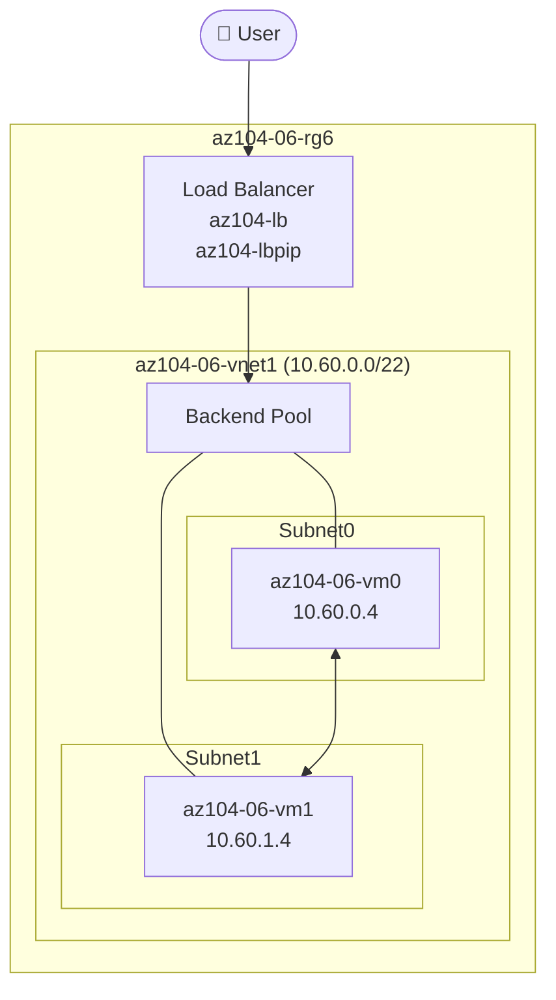

# Clase Seis - 1 de Octubre del 2026

# Repaso

* Networking
  * Virtual Network
  * Network Secutiry Group (NSG)
  * Creamos VM
    * Conexion por RDP
  * Importarcion del ARM template
  * VNet Peering
  
# Networking

* Hoy queremos instalar un Load Balancer



## Setup

* Abrimos el CLI
  
* Creamos el RG

```
az group create --name rg-az104-clase-06 --location westus
```

* Crear la VNet

```powershell
New-AzVirtualNetwork -Name Vnet-10.0 -ResourceGroupName rg-az104-clase-06 -Location westus -AddressPrefix 10.0.0.0/16
```

* Crear la SubNet

```bash
 az network vnet subnet create --resource-group rg-Az104-Clase-06 --vnet-name VNet-10.1 --name subnet-10.0.0 --address-prefixes 10.0.0.0/24     
```

* Creo dos VM (con el portal)
    *  El mismo proceso por duplicado
    *  Name: vm-webserver-00  y vm-webserver-01
    *  Las dos en la misma subnet que creamos antes
    
*  Me van a quedar con IP
  *  10.0.0.4
  *  10.0.0.5

*  Tambien se crearon 2 NSG
  *  vm-webserver-00-nsg
  *  vm-webserver-01-nsg

*  Me voy a conectar a las vm y les voy a instalar IIS en ambas
    *  Me conecto a las 2 vm por RDP
    *  Abro powershell
    *  Ejecuto en ambas

```
Install-WindowsFeature -name Web-Server -IncludeManagementTools
```

* Mientras lo instala vamos a tener que habilitar en los NSG el puerto 80 y 443 (x2)

 

* Chequear que se puede acceder al IIS desde mi pc local

* Una vez Instalado el IIS rescribimos el archivo del home con un string personal

```
Set-Content -Path "C:\inetpub\wwwroot\iisstart.htm" -Value "Hola desde webserver--00"
```
> Cambiar Hola desde webserver--01

* Vamos a crear el Load Balancer
 * Basics
   * Tipo : Standar Load Balancer
   * Name : lb-webservers-westus
   * SKU : Standard
   * Tipo : Public
   * Tier : Regional
 * Frontend IP Configuration
     * Name: fe-pip-lb-webserrvers-westus
        * Tiene una Public IP Asociada : pip-lb-webserrvers-westus
 * Backend Pool
     * Name : be-lb-webservers-westus
     * Elijo la vnet de mi laboratorio
     * Agrego las dos maquinas virtuales
* Creamos nuestro Load Balancer

* Crear las Regla de Balanceo
  * Que es
     * Estas reglas basicamente dicen lo siguiente:
     * Cuando recibas una peticion a la ip publica del load balancer redireccionala a una maquina del "Backend Pool" (Grupo de Vms)
     * Para saber que maquinas responden utiliza un heath probe que es un robot que periodicamente chequea en un puerto si la maquina esta viva
     * Con Helth Probe se evita enviar peticiones a maquinas que no responden
   * Datos
     * Name :lbrule-lb-webservers-westus
     * Frontend IP Address : fe-pip-lb-webserrvers-westus
     * Backend Pool : be-lb-webservers-westus
     * De Puerto : 80
     * A Puerto : 80
     * Health Probe
       * Name: hp-lb-webservers-wetus
       * Protocol : TCP
       * Port : 80
       * Cada : 5segundos

  * Vamos a ver la MAGIA
    * Buscar la ip publica del loas balancer
 
 * A veces me dice


 * Si le doy f5 como un condendo dice
  


* Borremoslas IP publicas de las VM
       
---
BREAK HASTA y 10
---

* El Loab Balancer no es la unica opcion para Balanceo de Carga
  * Se usa para balancear trafico generico
  * Funciona a nivel capa 4 de osi
  * Es un recurso economico
* Pero si tenes una pagina web (como hicimos en el lab) y queres hacer reglas de balanceo a nivel capa 7
  * Ejemplo Los request /api van a una vitual, los request /image van a otra, el esto va a otro backend pool
  * En ese caso hay usar otro recurso

  ## Application Gateway

* El Appication Gateway tiene que ir en su propia subnet independiente y no tiene que compartir recursos con nadie mas en esa subnet
